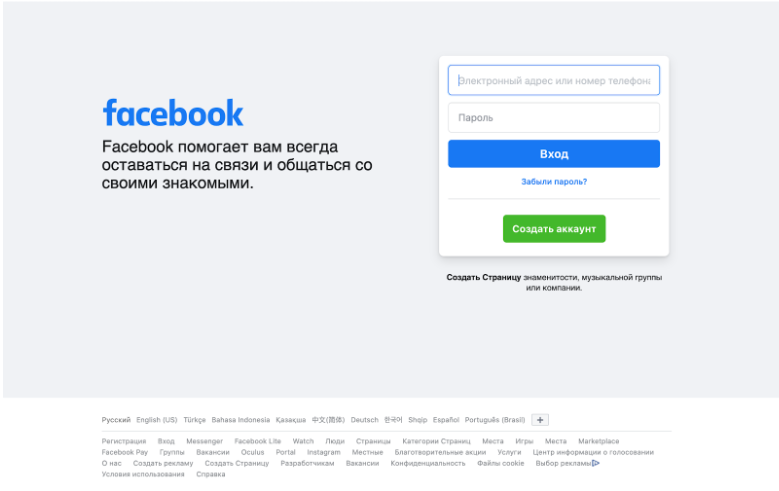
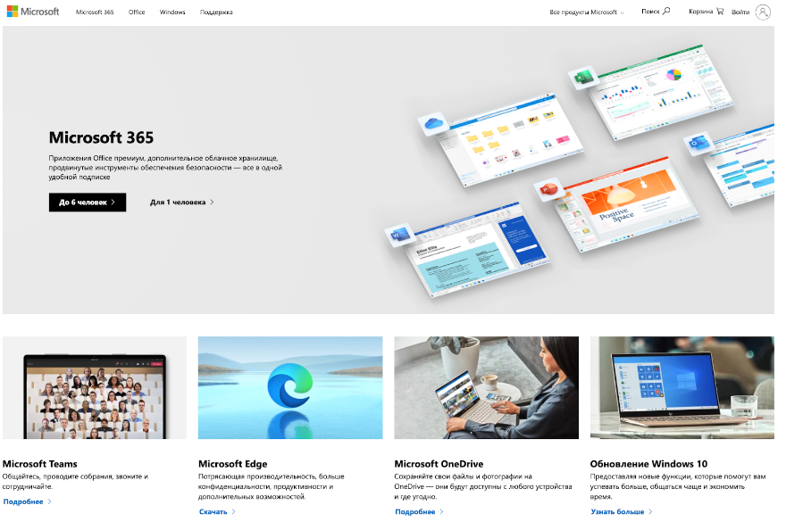

# Show your markup knowledge
## Task 1. 
### Create a login page of [Facebook](https://www.facebook.com/) using html/html5 and css/css3.  

## Task 2. 
### Create a login page of [Instagram](https://www.instagram.com/) using html/html5 and css/css3. 

## Task 3.
### Create a homepage (blocks in following screen) of [Microsoft](https://microsoft.com/ru-kz) using html/html5 and css/css3.

## Useful links
https://roadmap.sh/  
https://www.w3schools.com/html/  
https://html5andcss3.org/  
https://css-tricks.com/snippets/css/a-guide-to-flexbox/  
Style guide HTML: https://www.w3schools.com/html/html5_syntax.asp  
Style guide CSS: https://github.com/airbnb/css  