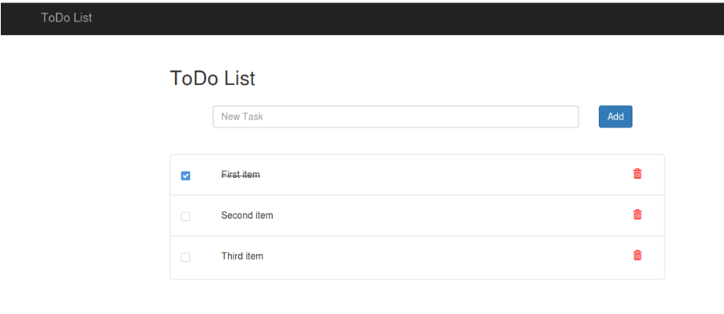

# Show your knowledge for HTML/CSS/JavaScript

**First task:**

[Source](https://javascript.info/)  
till section Data Types, inclusively (not 2.5 points, but section/раздел Data Types)  
Collect all the solutions in one folder and push it to your git repo

**Second task:**  
Create a simple todo list app with all working actions.  
adding new item  
marking as “done” (checkbox)  
deleting item  

## Useful links  
https://learn.javascript.ru/  
https://www.w3schools.com/js/  
https://developer.mozilla.org/ru/docs/Learn/Getting_started_with_the_web/JavaScript_basics  
Style guide JavaScript: https://github.com/airbnb/javascript  
